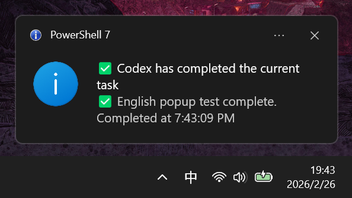
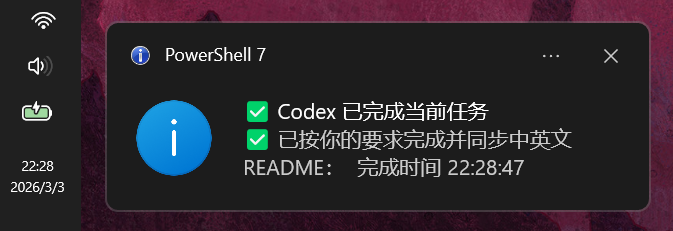

<h1 align="center">Codex-Notifier</h1>

<p align="center">
  <a href="#"></a>
  <a href="#"></a>
  <a href="LICENSE"></a>
  &nbsp;&nbsp;
  <a href="README-zh.md"></a>
</p>

✅ **Get notified immediately when Codex tasks finish | Native desktop toast popup | Native notification sound**  
✅ **Click to jump back to the related VS Code window | Multi-window Codex parallel sessions | Supports all Codex versions**  
✅ **One-line prompt for automated install and verification | Windows | VS Code Codex extension | Simple hooks pipeline**

Codex-Notifier actively reminds you when Codex tasks complete (through popup and sound).  
It does not change your Codex workflow.

## 🎬 Demo

<p align="center">
  
  
</p>

## ✨ Features

| Feature | Description |
| :--- | :--- |
| **Hook-based Notification** | Shows a desktop alert and sound as soon as a Codex task finishes. |
| **Client-scoped Delivery** | Triggers only for Codex CLI and VS Code extension sessions; Codex Desktop sessions are ignored. |
| **Click-to-Jump VSCode** | Click the notification to jump back to the related VS Code window. |
| **Safe Config Merge** | Keeps your existing Codex settings and only adds what this tool needs. |
| **Operational Scripts** | Includes ready-to-run scripts for install, health check, and uninstall. |
| **Bilingual CN/EN** | Includes both Chinese and English docs and install prompts. |
| **i18n/l10n Scaffold** | Built for multi-language growth so bilingual content stays consistent over time. |

## 🚀 Install Prompt (Send to Codex)

```text
Please install Codex-Notifier on Windows: clone https://github.com/MaxMiksa/Codex-Notifier, run scripts/install.ps1; if a Stop hook conflict appears, merge ~/.codex/config.toml using templates/stop-hook.snippet.toml while keeping existing hooks; then run scripts/doctor.ps1 and report back.
```

<details>
  <summary>(Optional) Manual install and verification</summary>

1. Run the installer in the repository directory:
```powershell
pwsh -NoProfile -ExecutionPolicy Bypass -File .\scripts\install.ps1
```
2. Ask Codex to execute a minimal task, for example:
```powershell
codex exec "say hi"
```
3. When completion notification appears, click the balloon to jump back to the matching VSCode window.

</details>

## 📚 More Info

<details>
  <summary>Requirements & Limits</summary>

- Windows + PowerShell (`pwsh.exe`) required.
- Codex CLI and VSCode are expected to be installed.
- v0.2.4 targets Windows only.
- Notifications are scoped to Codex CLI and VS Code extension sessions; Codex Desktop sessions are intentionally skipped.
- Balloon click callback works within the active notification window, not guaranteed from historical Action Center entries.

</details>

<details>
  <summary>Compliance (Global Minimal)</summary>

- Privacy notice: notifications are generated only from local runtime events.
- Local processing: payload parsing and window matching are performed on-device.
- No upload: Codex-Notifier does not forward payload content to external services.
- Audit log: runtime metadata is recorded in local JSONL logs.

</details>

<details>
  <summary>Developer Guide</summary>

- Install to real Codex home:
```powershell
pwsh -NoProfile -ExecutionPolicy Bypass -File .\scripts\install.ps1 -CodexHome "$HOME\.codex"
```
- Force locale/legal profile:
```powershell
pwsh -NoProfile -ExecutionPolicy Bypass -File .\scripts\install.ps1 -Locale "zh-CN" -LegalProfile "global-minimal"
```
- Validate installation:
```powershell
pwsh -NoProfile -ExecutionPolicy Bypass -File .\scripts\doctor.ps1 -RunSmokeTest
```
- Uninstall managed hook artifacts:
```powershell
pwsh -NoProfile -ExecutionPolicy Bypass -File .\scripts\uninstall.ps1
```

</details>

<details>
  <summary>Troubleshooting</summary>

- If install returns `conflict_manual_merge_required` (`exit 20`), merge the stop hook snippet manually.
- If click jump does not hit expected workspace, verify window title contains `- <workspace> - Visual Studio Code`.
- Runtime logs are written to `~/.codex/hooks/logs/notify-stop-events.jsonl`.

</details>

## 🤝 Contribution & Contact

Welcome to submit Issues and Pull Requests!
Any questions or suggestions? Please contact Zheyuan (Max) Kong (Carnegie Mellon University, Pittsburgh, PA).

Zheyuan (Max) Kong: kongzheyuan@outlook.com | zheyuank@tepper.cmu.edu
GitHub: https://github.com/MaxMiksa/Codex-Notifier

